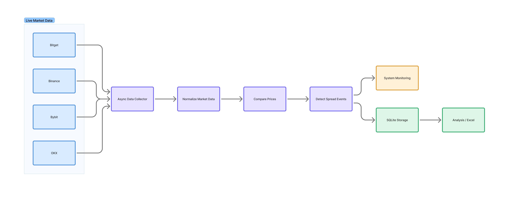

# Market Data Analysis System

A real-time system for collecting, comparing, and analyzing live market data from multiple cryptocurrency exchanges.

The project was built to study price differences between exchanges and record how those differences change over time.

Instead of manually checking prices, the system connects to several exchanges at the same time, processes live market updates, detects spread events, and stores the results for later analysis.

> ⚠️ This repository is a portfolio version of a system originally built for real-world market research.

---

## What Does It Do?

In simple terms:

1. Receives live prices from multiple exchanges.
2. Compares the same market across exchanges.
3. Detects when a meaningful price difference appears.
4. Tracks how long the difference exists.
5. Stores the event and related market data.
6. Makes the collected data available for further analysis.

---

## Architecture

Live exchange data is collected, normalized, compared in real time, and stored when meaningful spread events are detected.

---

## Technical Highlights

- Real-time WebSocket data collection
- Multiple exchanges monitored simultaneously
- Asynchronous processing with Python
- Spread-event detection and tracking
- Persistent storage using SQLite
- Market event logging and analysis
- Designed for deployment on remote VPS servers

---

## Example Output

The system records detected price-difference events so they can be analyzed later.

A simplified example looks like this:

| Market | Buy Exchange | Sell Exchange | Start Spread | Max Spread | Duration |
|---|---|---|---:|---:|---:|
| BEATUSDT | Binance | OKX | 0.467% | 0.467% | 38 ms |
| JELLYJELLYUSDT | Binance | OKX | 0.314% | 0.703% | 26 ms |
| SAPIENUSDT | OKX | Binance | 0.315% | 0.315% | 20 ms |
| ZBTUSDT | OKX | Binance | 0.314% | 0.461% | 30 ms |
| SPKUSDT | Binance | OKX | 0.348% | 0.418% | 21 ms |

Two sample datasets are included:

- [`Recruiter-friendly sample`](sample_data/spread_events_recruiter_sample.csv) — simplified fields for quick understanding.
- [`Full technical sample`](sample_data/spread_events_full_sample.csv) — all recorded fields for deeper technical inspection.

More information about the datasets is available in [`sample_data/README.md`](sample_data/README.md).

---

## Deployment

The system was tested on VPS servers in:

- Tokyo
- Singapore
- Hong Kong

Different server locations were used to evaluate network latency and data delivery behaviour.

---

## Tech Stack

- Python
- asyncio
- WebSockets
- SQLite
- Git

---

## Example Output

Sample output coming soon.
